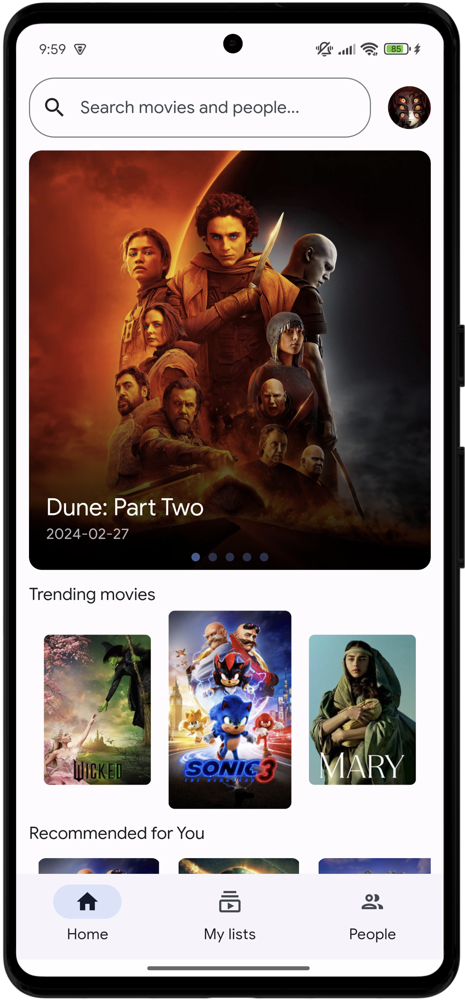
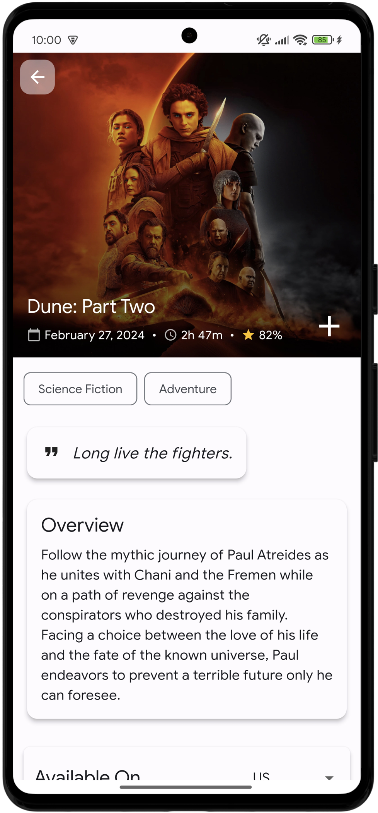
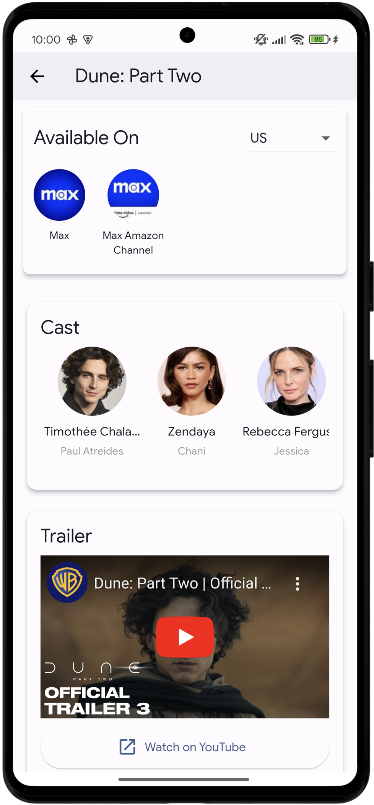
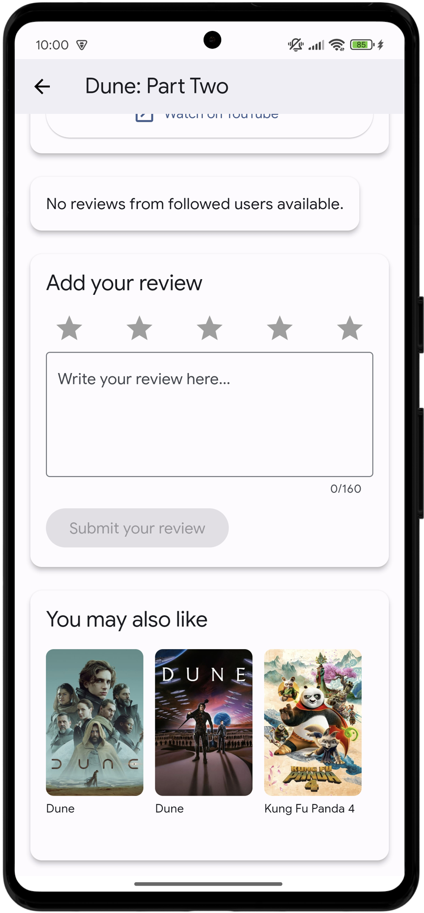

# Watchee 🎬

A modern, feature-rich movie tracking and social networking application built with Flutter. Track your favorite movies, share watchlists with friends, and discover new content.

<p align="center">
  
  
  
  
</p>
## Features ✨

- **User Authentication**
  - Email/Password and Google Sign-in
  - Secure user authentication with Firebase
  - Profile customization and management

- **Movie Management**
  - Create and manage personal watchlists
  - Mark movies as watched or liked
  - Write and share movie reviews
  - Track movie viewing history

- **Social Features**
  - Follow other users
  - Share watchlists with friends
  - Collaborative watchlists
  - Real-time notifications
  - User search functionality

- **Advanced UI/UX**
  - Material Design 3 implementation
  - Dynamic theming (Light/Dark mode)
  - Responsive layout for both phones and tablets
  - Push notifications

## Technology Stack 🛠️

- **Frontend**: Flutter/Dart
- **Backend**: Firebase
  - Authentication
  - Cloud Firestore
  - Cloud Storage
  - Cloud Messaging
- **APIs**:
  - TMDB API for movie data
  - JustWatch datas through TMDB API for streaming availability

## Getting Started 🚀

### Prerequisites

- Flutter SDK (latest stable version)
- Firebase project setup
- TMDB API key
- Android Studio / VS Code with Flutter extensions

### Installation

1. Clone the repository:
```bash
git clone https://github.com/teomac/watchee.git
```

2. Install dependencies:
```bash
cd watchee
flutter pub get
```

3. Configure Firebase:
   - Create a new Firebase project
   - Add Android/iOS apps in Firebase console
   - Download and add configuration files
   - Enable Authentication methods (Email/Password and Google Sign-in)
   - Set up Cloud Firestore

4. Configure environment variables:
   - Create a `.env` file in the project root
   - Add your API keys:
     ```
     TMDB_API_KEY=your_tmdb_api_key
     ```

5. Run the app:
```bash
flutter run
```

## Architecture 🏗️

The project follows a clean architecture pattern with:
- Service-based dependency injection
- Repository pattern for data management
- Provider for state management
- Separation of concerns between UI, business logic, and data layers

## Testing 🧪

Run tests using:
```bash
flutter test
```

## Academic Context 🎓

This project was developed as part of the Design and Implementation of Mobile Application course at Politecnico di Milano. It demonstrates:
- Modern mobile application development practices
- Secure user authentication and data management
- Social features implementation
- Real-time updates and notifications
- Responsive UI design
- Integration with external APIs

## License 📄

This project is licensed under the MIT License - see the [LICENSE](LICENSE) file for details.

## Contact 📧

- Matteo Laini - matteo.laini@mail.polimi.it
- Matteo Macaluso - matteo.macaluso@mail.polimi.it

Project Link: [https://github.com/teomac/watchee](https://github.com/teomac/watchee)
